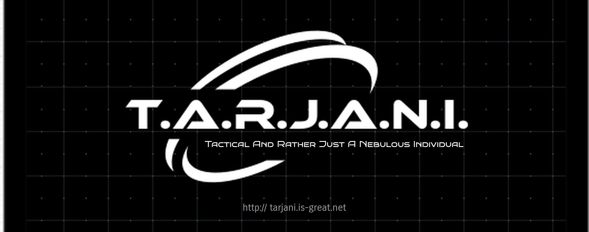

# TARJANI - Demo
______
This repository contains video demonstrations for all the features TARJANI has. It also has the Jupyter Notebook which was used during the demo to directly oprn in colab and run there.  


| Notebook Name | Action |
| -------------- | -------- |
| Demo_TARJANI.ipynb | [](https://colab.research.google.com/github/Rutvik-Trivedi/tarjani-demo/blob/main/Demo_TARJANI.ipynb) |


To view the videos, you will have to either clone or download the repository. If you just want to run the notebook, you can directly open it in colab  
To clone the repo, run
```bash
git clone https://github.com/Rutvik-Trivedi/tarjani-demo.git
```
or download using the download button on the repository main page  


# Contributing
Contributions are always welcome! Your contributions will help TARJANI improve a lot. Please open a pull request or provide your feedback on TARJANI.
